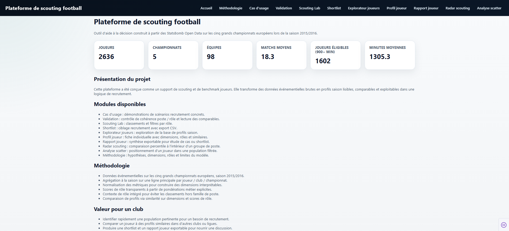
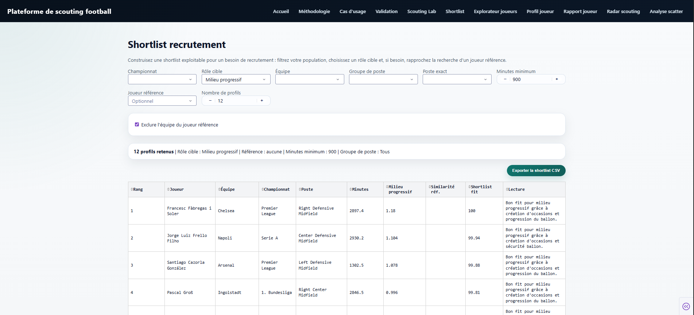
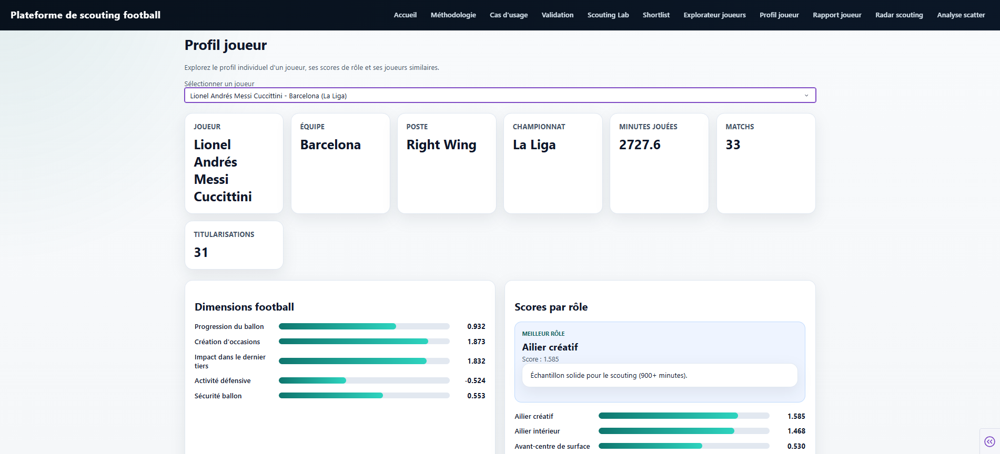
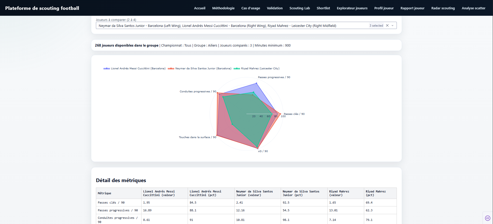

# Plateforme de Scouting Football

<p align="center">
  Prototype d'outil d'aide à la décision pour le scouting, le recrutement et l'analyse de profils joueurs.
</p>

<p align="center">
  Données : <strong>StatsBomb Open Data</strong> | Périmètre : <strong>Top 5 européen 2015/2016</strong>
</p>

## Aperçu
Cette plateforme transforme des `event data` football brutes en `profils joueurs lisibles`, `comparables` et `actionnables`.

Le projet combine :
- une logique `data engineering` pour structurer la donnée
- une logique `football analytics` pour construire des métriques interprétables
- une logique `produit` avec une application Dash pensée pour une lecture scouting

## Interface
Quelques vues de l'application, pensées pour un usage scouting et recrutement.

### Démonstration
Vue d'ensemble rapide de la plateforme, de la navigation entre modules et du type d'analyse proposé.

<p align="center">
  
</p>

<br />

### Accueil
Une entrée claire pour comprendre le périmètre, la base étudiée et la proposition de valeur du projet.

<p align="center">
  
</p>

<br />

### Shortlist recrutement
Un module orienté décision pour filtrer une population, cibler un rôle et construire une liste exploitable de profils.

<p align="center">
  
</p>

<br />

### Profil joueur
Une fiche individuelle pour lire rapidement l'identité du joueur, ses dimensions football, ses rôles dominants et ses comparables.

<p align="center">
  
</p>

<br />

### Radar scouting
Une comparaison visuelle entre joueurs d'un même groupe de poste à partir de percentiles adaptés au contexte de lecture.

<p align="center">
  
</p>

## Objectif métier
Cette plateforme a été pensée comme un prototype exploitable par une cellule :
- de `scouting`
- de `recrutement`
- de `performance`

Elle permet notamment de :
- filtrer des populations de joueurs
- comparer des profils
- identifier des joueurs similaires
- produire des shortlists
- générer des rapports joueurs exportables
- documenter la logique des scores pour garder un outil auditable

## Fonctionnalités principales
- `Accueil`
Présentation du projet, du périmètre et de la valeur métier.

- `Méthodologie`
Explication des hypothèses, des dimensions football, des rôles et des limites du modèle.

- `Cas d'usage`
Scénarios concrets de recrutement pour montrer comment utiliser l'outil dans un besoin réel.

- `Validation`
Contrôle de cohérence entre rôles, familles de poste et lectures de similarité.

- `Scouting Lab`
Classements de joueurs selon un rôle cible avec filtres championnat, équipe, poste et minutes.

- `Shortlist`
Module orienté recrutement pour construire une shortlist et l'exporter en CSV.

- `Explorateur joueurs`
Vue d'exploration globale des profils saison.

- `Profil joueur`
Fiche individuelle avec dimensions, meilleurs rôles et joueurs similaires.

- `Rapport joueur`
Synthèse exportable en HTML pour construire un cas scouting ou une fiche de travail.

- `Radar scouting`
Comparaison percentile par groupe de poste.

- `Analyse scatter`
Positionnement d'un joueur dans une population filtrée sur deux métriques.

## Pipeline data
Le pipeline suit les étapes suivantes :

1. ingestion des compétitions, matchs, lineups et events StatsBomb
2. nettoyage des événements et standardisation des coordonnées
3. agrégation au niveau `joueur-match`
4. agrégation au niveau `joueur-saison`
5. sélection d'une ligne principale par `joueur / club / championnat`
6. ajout des minutes et calcul des métriques `par 90`
7. construction de dimensions football standardisées
8. calcul de scores de rôle
9. calcul de similarité entre joueurs
10. calcul de percentiles par groupe de poste

## Dimensions football
Le projet repose sur 5 dimensions principales :
- `Progression du ballon`
- `Création d'occasions`
- `Impact dernier tiers`
- `Activité défensive`
- `Sécurité ballon`

Ces dimensions servent de base aux rôles et à la similarité.

## Rôles modélisés
Le projet inclut actuellement des rôles comme :
- milieu progressif
- regista
- milieu récupérateur
- meneur avancé
- ailier créatif
- ailier intérieur
- défenseur central relanceur
- défenseur central stoppeur
- latéral progressif
- avant-centre de surface

Les scores sont `contextualisés par famille de poste` pour éviter des tops incohérents hors rôle cible.

## Similarité
La similarité joueur est calculée à partir :
- des dimensions football
- des scores de rôle

Elle permet de rapprocher des profils comparables dans d'autres équipes ou championnats.

## Choix importants de modélisation
- une ligne centrale par `joueur / club / championnat`
- priorité à des métriques `interprétables`
- pas de modèle opaque de type `black box`
- seuil de `900 minutes` pour stabiliser une partie des lectures scouting
- validation par famille de poste pour améliorer la cohérence métier

## Limites actuelles
- une seule saison couverte dans cette version
- pas d'ajustement par style d'équipe ou volume de possession
- pas de données physiques, contractuelles ou financières
- pas de vidéo intégrée
- les scores de rôle restent dépendants des hypothèses de pondération

Le projet doit être lu comme un `outil d'appui à la décision`, pas comme un système autonome de recrutement.

## Stack technique
- `Python`
- `Pandas`
- `NumPy`
- `scikit-learn`
- `Dash`
- `Plotly`
- `StatsBombPy`
- `Jupyter Notebook`

## Structure du projet
```text
football-scouting-platform/
├── .github/
│   └── assets/           # captures et GIFs du README
├── app/                  # application Dash
├── data/                 # données brutes, intermédiaires et transformées
├── notebooks/            # notebooks d'exploration et de prototypage
├── sql/                  # schéma et vues SQL
├── src/
│   ├── ingestion/        # chargement des données source
│   ├── processing/       # nettoyage et structuration
│   ├── features/         # construction des métriques et scores
│   ├── modeling/         # similarité
│   └── utils/            # utilitaires métier
├── tests/                # tests unitaires ciblés
├── main.py               # point d'entrée principal
├── requirements.txt
└── README.md
```

## Installation
Créer un environnement virtuel :

```bash
python -m venv .venv
```

Activer l'environnement sous Windows :

```bash
.venv\Scripts\activate
```

Installer les dépendances :

```bash
pip install -r requirements.txt
```

## Utilisation
### Lancer le pipeline data
```bash
python main.py pipeline --stage all
```

### Lancer l'application
```bash
python main.py app --debug
```

## Vérification
```bash
python -m unittest discover -s tests -v
```

## Ce que ce projet démontre
- la capacité à structurer un pipeline data propre
- la capacité à transformer des données football en indicateurs métier
- la capacité à concevoir un outil orienté utilisateur
- la capacité à documenter les hypothèses et les limites
- la capacité à articuler `engineering`, `analytics` et `usage terrain`

## Évolutions possibles
- ajout d'autres saisons
- ajustements par contexte collectif
- exports plus avancés
- enrichissement de la validation football
- ajout de cas d'usage performance / match analysis
- ajout de données contractuelles ou de marché si disponibles

## Auteur
Projet réalisé par `Mehdi`, avec une orientation forte vers les métiers de :
- `data dans le football`
- `scouting`
- `performance`
- `recrutement`
