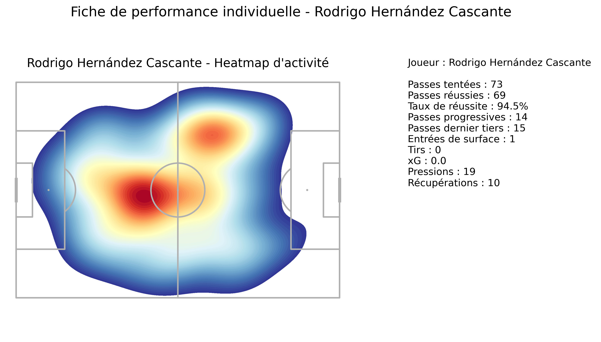
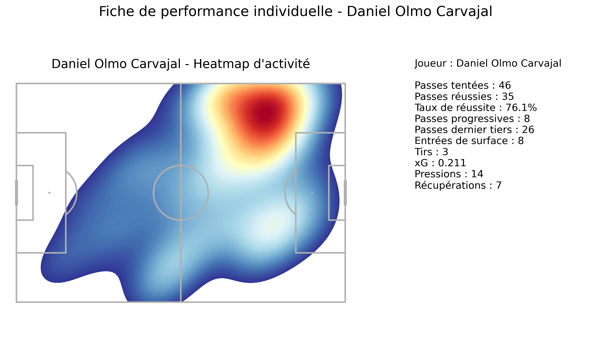
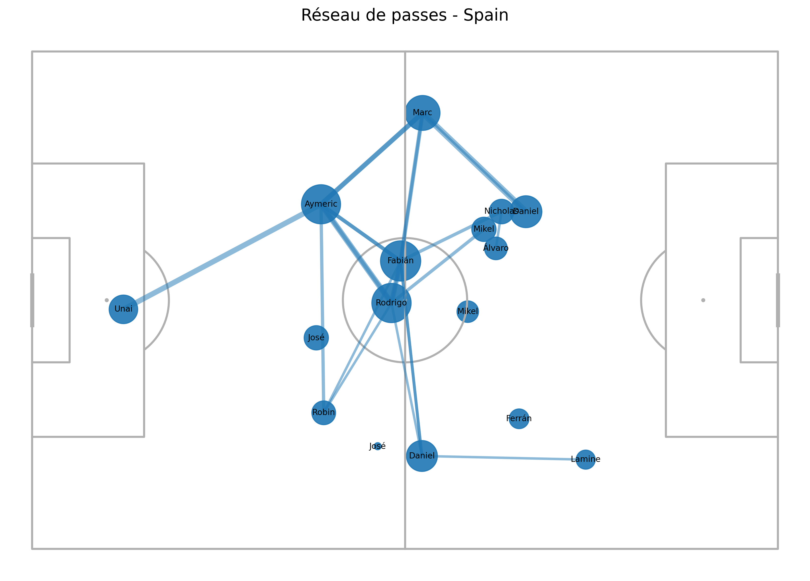

# Football Performance Analysis — Spain vs Germany (EURO 2024)

Projet d’analyse de performance football à partir des open data StatsBomb, appliqué au quart de finale de l’EURO 2024 entre l’Espagne et l’Allemagne.

L’objectif est de construire un workflow d’analyse **joueur + équipe** proche de la logique utilisée dans un environnement de staff technique :
- structuration des event data,
- construction de métriques football,
- visualisations adaptées au contexte match analysis,
- interprétation tactique exploitable.

## 1. Match étudié

- **Compétition** : UEFA EURO 2024
- **Match** : Spain vs Germany
- **Date** : 2024-07-05
- **Match ID StatsBomb** : 3942226

## 2. Objectifs du projet

Ce projet vise à analyser :

### Analyse individuelle
- les zones d’activité d’un joueur
- son implication dans le jeu de passe
- sa contribution offensive
- son impact défensif

### Analyse collective
- le réseau de passes de l’équipe
- les zones de progression du ballon
- les séquences menant à des tirs
- l’organisation globale de la circulation

## 3. Données utilisées

Source : **StatsBomb Open Data**

Les données exploitées sont des **event data** de match, incluant notamment :
- passes
- tirs
- pressions
- récupérations
- possessions
- coordonnées spatiales des actions

## 4. Joueurs mis en avant

### Rodri
Profil principal de l’analyse individuelle :
- contrôle du jeu
- stabilité dans la circulation
- implication défensive
- rôle de régulateur axial

### Dani Olmo
Profil secondaire offensif :
- activité dans le dernier tiers
- création
- accès aux zones dangereuses
- menace directe au tir

## 5. Métriques construites

### Jeu de passe
- passes tentées
- passes réussies
- taux de réussite
- passes progressives
- passes vers le dernier tiers
- passes dans la surface

### Offensive
- tirs
- xG
- implication dans les possessions menant à un tir

### Défensive
- pressions
- récupérations

### Collective
- positions moyennes
- implication dans le réseau de passes
- connexions de passes entre joueurs
- possessions espagnoles menant à un tir

## 6. Visualisations produites

- heatmap d’activité de Rodri
- pass map de Rodri
- fiche de synthèse individuelle de Rodri
- shot map de Dani Olmo
- fiche de synthèse individuelle de Dani Olmo
- réseau de passes de l’Espagne
- carte des passes progressives de l’Espagne

Les figures sont exportées dans :

```text
reports/figures/
```

## 7. Principaux constats

### Rodri
- profil de régulateur axial
- 73 passes tentées, 94.5 % de réussite
- 14 passes progressives
- 19 pressions et 10 récupérations
- impact fort dans l’équilibre du jeu
    

### Dani Olmo
- profil offensif plus avancé
- 3 tirs, 0.211 xG
- 8 passes progressives
- 26 passes vers le dernier tiers
- 8 passes dans la surface
    

### Espagne
- réseau structuré autour de Fabián Ruiz, Rodri, Laporte, Cucurella et Dani Olmo
- fort ancrage axe gauche / couloir gauche
- 19 possessions menant à un tir
- occasions produites via plusieurs contextes : jeu courant, transitions, touches, coups francs
    
## 8. Structure du projet

football-performance-analysis/
│
├── data/
│   ├── raw/
│   └── processed/
│
├── notebooks/
├── src/
├── reports/
│   └── figures/
├── tests/
│
├── README.md
├── requirements.txt
├── .gitignore
└── main.py

## 9. Installation

Créer un environnement virtuel puis installer les dépendances :

```bash
python -m venv .venv
```

Windows :
```bash
.venv\Scripts\activate
```

Mac / Linux :
```bash
source .venv/bin/activate
```

Puis installer les packages :

```bash
pip install -r requirements.txt
```

## 10. Exécution

Prétraitement :
```bash
python -m src.preprocessing
```

Construction des features :
```bash
python -m src.features
```

Analyse joueur :
```bash
python -m src.player_analysis
```

Visualisations joueur :
```bash
python -m src.visualizations
```

Analyse collective :
```bash
python -m src.team_analysis
```

Séquences menant aux tirs :
```bash
python -m src.sequence_analysis
```

## 11. Compétences démontrées

Ce projet met en avant :
- structuration d’un pipeline data en Python
- nettoyage et transformation d’event data
- construction de métriques football interprétables
- production de visualisations spécialisées
- lecture tactique d’un match à partir de données ouvertes

## 12. Axes d’amélioration

Pistes d’extension possibles :
- ajout des données 360 StatsBomb
- comparaison Espagne / Allemagne
- séparation par mi-temps ou avant / après but
- ajout de métriques de réception et de carries
- automatisation d’un rapport PDF ou dashboard
